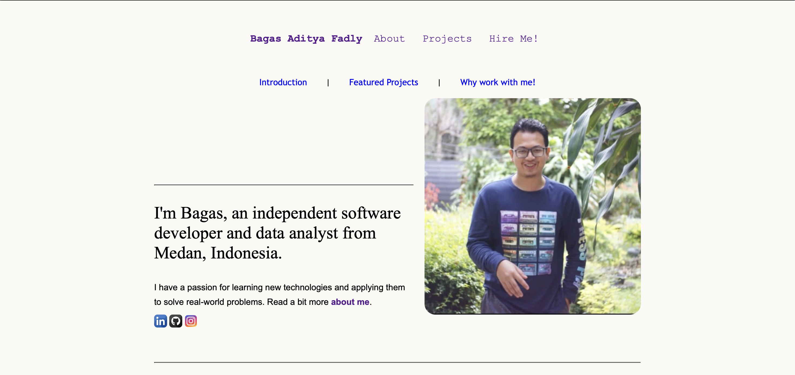

# PERSONAL PORTFOLIO

My Personal Portfolio website at 
https://revou-fsse-oct25.github.io/milestone-1-Thefastlearner-1/index.html

## Background

This is my assignment for RevoU. The purpose of this project is to review what I’ve learned at RevoU. The website might not be perfect, but I’ve done my best to make it simple and elegant. I used GitHub to publish it as a web page that can be accessed online. The website is designed to introduce the developer, showcase projects, and demonstrate fundamental front-end development skills.

## Overview

The website is developed by html and is intended be statically generated (i.e. no backend). In order to do that, the content is mostly separated from the codebase.

There are a number of types of content in-use throughout the site:

Static content: like the [home page](https://revou-fsse-oct25.github.io/milestone-1-Thefastlearner-1/index.html), [about page](https://revou-fsse-oct25.github.io/milestone-1-Thefastlearner-1/pages/about.html) and [hire page](https://revou-fsse-oct25.github.io/milestone-1-Thefastlearner-1/pages/form.html). These are just hard-coded marketing-style pages using html and custom components.

Photos: 

This portfolio serves as a digital introduction to my professional and creative background.  
It demonstrates the application of core web technologies — from layout design to responsive UI components.

**Main Sections:**
- **Name:** A brief introduction and navigation bar for easy access.  
- **About:** A summary of personal background, education, and goals.  
- **Projects:** A showcase of completed works and technical exercises.  
- **Hire:** Project collaboration offers (web development, design, etc.).

The design emphasizes simplicity, readability, and clarity — ensuring the content remains the main focus.

## Content
The project structure for the website is placed:
```
milestone-1-Thefastlearner-1/
├─ index.html
├─ pages/
│ ├─ about.html
│ ├─ form.html
│ ├─ projects.html
├─ assets/
│ ├─ bagas.jpg
│ ├─ bagas1.png
│ └─ bagas2.png
├─ logo/
│ └─ github.png
│ └─ instagram.png
│ └─ linkedin.png
└─ README.md
```
When changes are made to anything in milestone-1-Thefastlearner-1 you need to push those changes separately:
```
cd milestone-1-Thefastlearner-1
git add .
git commit
git push origin main
```

## Featured implements 

- **Responsive Design:** Layout adapts across devices (desktop, tablet, mobile).  
- **Navigation Bar:** Smooth section navigation with clear structure.  
- **Profile Section:** Includes introduction and photo.   
- **Contact Section:** Direct links to GitHub, LinkedIn, and instagram.  
- **Semantic HTML:** Structured and accessible markup following best practices.  
- **Deployed on GitHub Pages:** For public hosting and easy version control.

## Technologies used

| Category | Tools / Languages |
|-----------|------------------|
| **Markup** | HTML |
| **Version Control** | Git & GitHub |
| **Deployment** | GitHub Pages |

